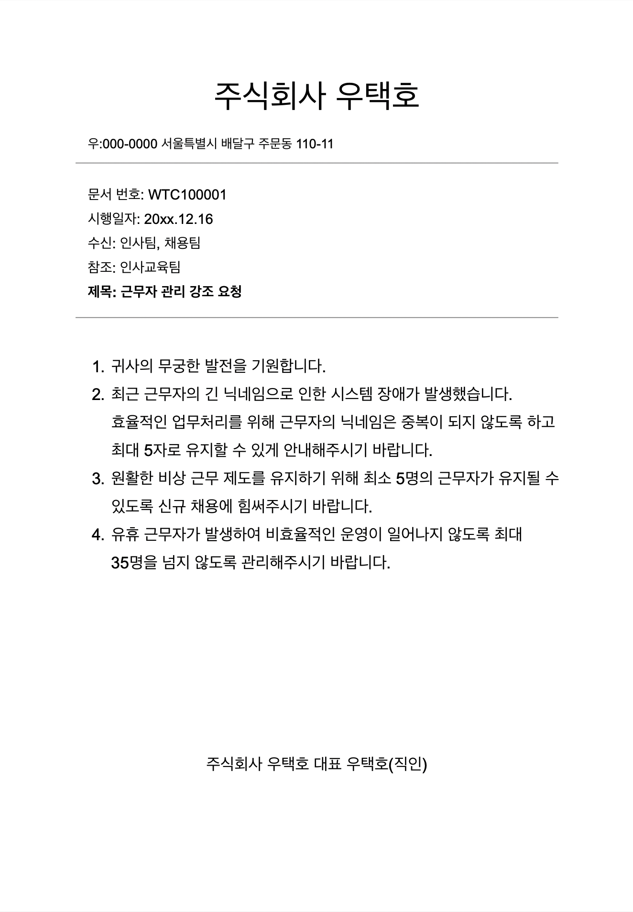

# 미션 - 개발자 비상근무

(5시간 제한) <br>
10:40 시작 <br>
-> 15:40 종료 예정 <br>
10:59 기능 요구사항 분석 완료 <br>
11:31 inputValidator 까지 구현 완료 <br>

<br><br>

## 기능 구현

- [ ] 입력
    - [X] 월과 시작 요일
        - [X] 시작 요일이 무조건 1일이 됨(조건)
        - [X] 월 1 미만 12 초과 예외
        - [x] 요일 월~일 아닐 경우 예외
    - [X] 평일 / 휴일 비상 근무 순번대로 사원 닉네임 입력
        - [X] 파싱 예외
        - [X] 파싱 separator 사이 빈문자 있을 경우 예외
        - [X] 닉네임이 중복인 경우 예외
        - [X] 닉네임이 5자 초과인 경우 예외
        - [X] 근무자가 최소 5명 이상 35명 이하이지 않으면 예외
        - [X] 둘 리스트 요소가 일치하지 않으면 예외 (같은 사원이 입력된 경우가 아닌 경우)
            - [ ] 이 모든 예외가 발생할 경우 '평일 순번'부터 다시 입력 받음
- [ ] 출력
    - [ ] 평일이면서 법정 공휴일인 경우에만 요일 뒤에 (휴일) 표기
    - [ ] 월 일 요일 근무자 형태로 1일부터 말일까지 출력
- [ ] 기능
    - [ ] 법정 공휴일 설정
    - [ ] 시작 요일이 무조건 1일이 됨(조건)
    - [ ] 근무자 배정 규칙에 따라 다음을 설정한다.
        - [ ] 근무자는 평일, 휴일에 각각 1회만 편성되지 않으면 예외
        - [ ] 연속 2일 배정을 피하기 위해 가장 앞의 날짜에 배정된 다음 근무자와 편성을 바꿔 편성한다.
          = 평->공 / 공->평 두 가지 경우 모두 마찬가지임
            - 배정을 하고 바꿀지 / 바꾸고 배정을 할지는 내맘임

<br><br>

## 🚀 기능 요구 사항

<우택호> 배달 주문 서비스의 서버 개발을 맡고 있는 개발 팀장 수아는 한 가지 고민이 있습니다. 어떻게 하면 효율적으로 인력을 배치하여 장애를 탐지하고 신속히 대응할 수 있을지에 관한 것입니다.

얼마 전 항저우 아시안 게임과 같이 배달 주문이 급증할 것으로 예상되는 상황에 대비하여, 서비스 장애를 최소화하고 사용자의 불편을 줄이기 위해 경기 일정마다 개발자를 배치했습니다. 당시에는 비상 대응 인력이 부족해서
경기 일정마다 같은 인원이 반복적으로 대기할 수밖에 없었습니다.

다행히 이제는 비상 대응 인력이 확보되어, 본격적으로 효율적인 장애 대응을 준비하려고 합니다. 먼저 담당 개발자가 가장 빠르게 대응할 수 있도록, '월별 비상근무표'를 편성할 계획이에요. 매번 비상근무표를 만드는 데
들어갈 리소스를 줄이기 위해, 이를 자동화할 수 있는 시스템을 개발하려고 합니다.

아래의 요구사항을 충족하는 비상근무표 생성 프로그램을 만들어주세요.

```
비상 근무를 배정할 월과 시작 요일을 입력하세요> 5,월
평일 비상 근무 순번대로 사원 닉네임을 입력하세요> 준팍,도밥,고니,수아,루루,글로,솔로스타,우코,슬링키,참새,도리
휴일 비상 근무 순번대로 사원 닉네임을 입력하세요> 수아,루루,글로,솔로스타,우코,슬링키,참새,도리,준팍,도밥,고니

5월 1일 월 준팍
5월 2일 화 도밥
5월 3일 수 고니
5월 4일 목 수아
...
```

### 비상 근무일 배정 규칙

- 기본적으로 순번에 따라 비상 근무일을 배정한다.
- 회사에서는 평일과 휴일(토요일, 일요일, 법정공휴일) 비상 근무 순번을 다르게 운영하고 있다.
- 평일 순번과 휴일 순번의 순서는 다를 수 있다.
- 비상 근무자는 평일 순번, 휴일 순번에 각각 1회 편성되어야 한다.
    - 잘못된 예시: 수아가 두 번 편성된 경우
      ```
      평일 순번: 수아, 루루, 글로, 솔로스타, 수아, 슬링키, 참새, 도리, 준팍, 도밥, 고니
      ```
- 근무자 보호와 비상 근무 운영의 효율을 위해, 비상 근무자는 어떤 경우에도 연속 2일은 근무할 수 없다.   
  순번상 특정 근무자가 연속 2일 근무하게 되는 상황에는, 다음 근무자와 순서를 바꿔 편성한다.    
  예를 들어, 수아가 평일인 목요일에 비상 근무를 서고, 다음 날인 금요일이 휴일이면서 순번상 또다시 수아가 근무해야 할 경우,    
  다음 휴일 근무자와 순서를 바꿔서 근무한다.
    - 예시)
        - 평일 순번: 준팍,도밥,고니,수아,루루,글로,솔로스타,우코,슬링키,참새,도리
        - 휴일 순번: 수아,루루,글로,솔로스타,우코,슬링키,참새,도리,준팍,도밥,고니
        - 근무 예시: 준팍(월요일),도밥(화요일),고니(수요일),수아(목요일),루루(금요일/휴일),수아(토요일/휴일),...


- 만약에 법정공휴일인 수요일에 수아가 비상 근무를 서고 다음 날 평일 순번이 수아인 경우에는,   
  다음 평일 근무자와 순서를 바꿔서 근무한다.
    - 예시)
        - 평일 순번: 준팍,도밥,수아,루루,글로,솔로스타,우코,슬링키,참새,도리,고니
        - 휴일 순번: 수아,루루,글로,솔로스타,우코,슬링키,참새,도리,준팍,도밥,고니
        - 근무 예시: 준팍(월요일),도밥(화요일),수아(수요일/휴일),루루(목요일),수아(금요일),루루(토요일/휴일),글로(일요일/휴일),...


- 비상 근무자 배정 시 다음 근무자와 순서를 바꿔야 하는 경우에는, 앞의 날짜부터 순서를 변경해야 한다.

### 비상 근무자 배정 관련 참고 문서




### 입출력 요구 사항

- 월(숫자)과 시작 요일(일, 월, 화, 수, 목, 금, 토) 정보를 입력받는다.
- 연도는 고려하지 않으며, 매년 2월은 28일까지만 있다고 가정한다.
- 평일 비상 근무 순서를 입력받는다.
- 휴일(토요일, 일요일, 법정공휴일) 비상 근무 순서를 입력받는다.

```
비상 근무를 배정할 월과 시작 요일을 입력하세요> 5,월
평일 비상 근무 순번대로 사원 닉네임을 입력하세요> 준팍,도밥,고니,수아,루루,글로,솔로스타,우코,슬링키,참새,도리
휴일 비상 근무 순번대로 사원 닉네임을 입력하세요> 수아,루루,글로,솔로스타,우코,슬링키,참새,도리,준팍,도밥,고니
```

- 올바르지 않은 입력을 할 경우 `[ERROR]`로 시작하는 에러 메시지를 출력 후 다시 입력받는다.
- 비상 근무를 배정할 월과 시작 요일의 입력 값이 올바르지 않은 경우, '비상 근무를 배정할 월과 시작 요일'부터 다시 입력받는다.

```
비상 근무를 배정할 월과 시작 요일을 입력하세요>
[ERROR] 유효하지 않은 입력 값입니다. 다시 입력해 주세요.
비상 근무를 배정할 월과 시작 요일을 입력하세요>
```

- 평일 순번 또는 휴일 순번의 입력 값이 올바르지 않은 경우, '평일 순번'부터 다시 입력 받는다.

```
비상 근무를 배정할 월과 시작 요일을 입력하세요> 1,금
평일 비상 근무 순번대로 사원 닉네임을 입력하세요> 준팍,도밥,고니,수아,루루,글로
휴일 비상 근무 순번대로 사원 닉네임을 입력하세요> 수아,수아,글로,고니,도밥,준팍
[ERROR] 유효하지 않은 입력 값입니다. 다시 입력해 주세요.
평일 비상 근무 순번대로 사원 닉네임을 입력하세요>
```

### 출력 요구 사항

- 평일이면서 법정공휴일의 경우에만 요일 뒤에 (휴일) 표기를 해야 한다.
- 비상 근무표 출력을 완료하면 프로그램은 종료된다.

```
5월 1일 월 준팍
5월 2일 화 도밥
5월 3일 수 고니
5월 4일 목 수아
5월 5일 금(휴일) 루루
5월 6일 토 수아
5월 7일 일 글로
5월 8일 월 루루
5월 9일 화 글로
5월 10일 수 솔로스타
5월 11일 목 우코
5월 12일 금 슬링키
5월 13일 토 솔로스타
5월 14일 일 우코
5월 15일 월 참새
5월 16일 화 도리
5월 17일 수 준팍
5월 18일 목 도밥
5월 19일 금 고니
5월 20일 토 슬링키
5월 21일 일 참새
5월 22일 월 수아
5월 23일 화 루루
5월 24일 수 글로
5월 25일 목 솔로스타
5월 26일 금 우코
5월 27일 토 도리
5월 28일 일 준팍
5월 29일 월 슬링키
5월 30일 화 참새
5월 31일 수 도리
```

---

## 🎯 프로그래밍 요구 사항

- 함수(또는 메서드)의 길이가 15라인을 넘어가지 않도록 구현한다.
- 사용자가 잘못된 값을 입력할 경우 `IllegalArgumentException`를 발생시키고, "[ERROR]"로 시작하는 에러 메시지를 출력 후 예시를 참고하여 입력을 다시 받는다.
    - `Exception`이 아닌 `IllegalArgumentException`, `IllegalStateException` 등과 같은 명확한 유형을 처리한다.

## ✏️ 과제 진행 요구 사항

- **`docs/how-to-solve.md`에서 미션 해결 전략 문항에 답변을 필수로** 작성한다.   
